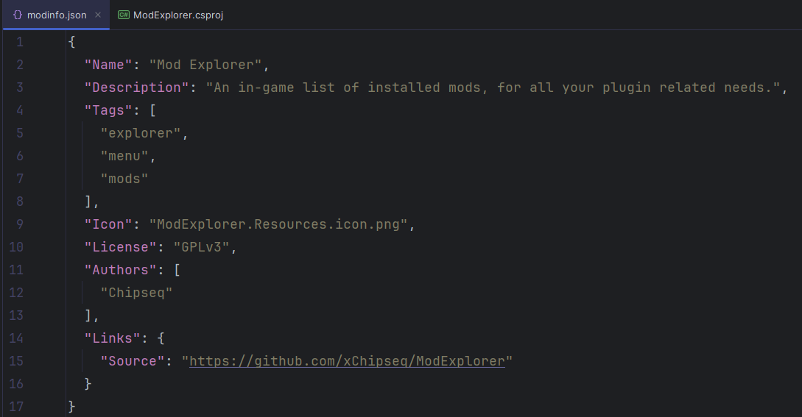
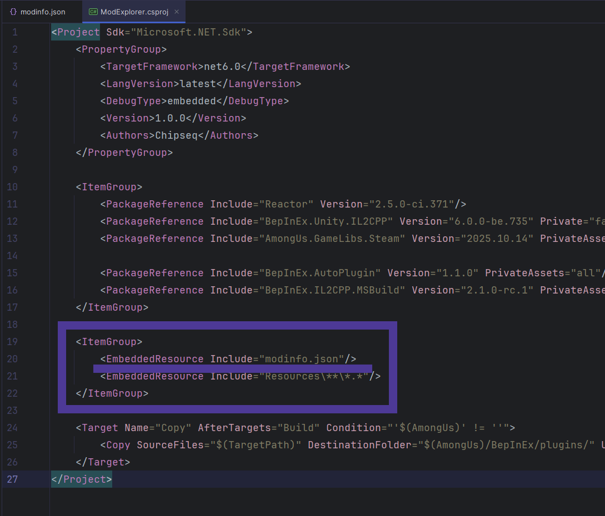

# Adding Additional Metadata
To make **Mod Explorer** display the metadata of your mod, you need to add a `modinfo.json` file somewhere inside your project and include it with **EmbeddedResource**. The mod will try to load this file out of your project and if it finds one, will use it in the info tab.

### Here's an example setup

# Supported Metadata Values
- `Name` - Name of your mod. It's taken from **BepInEx's Plugin Metadata** if not specified
- `Description` - Description of your mod
- `Tags` - List of tags, used for the searchbar
- `Authors` - List of authors, used for credits
- `Links` - Links redirects displayed at the bottom of the info page
- `Icon` - Project relative path to the icon of your mod
> [!Warning]
> The icon file **ALSO** needs to be embedded into the project, otherwise it cannot be loaded

