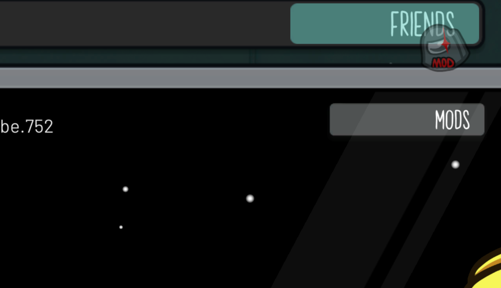
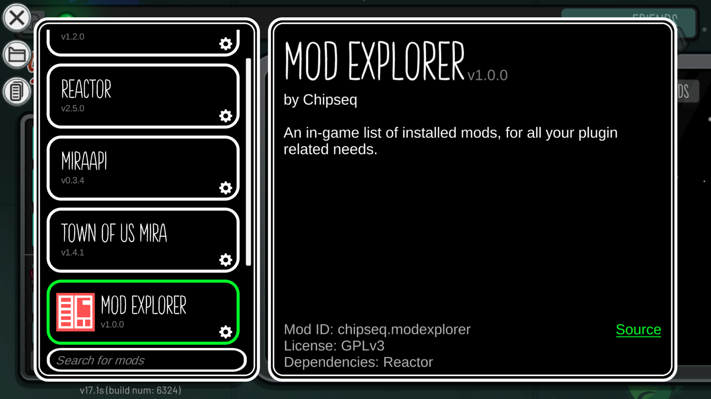
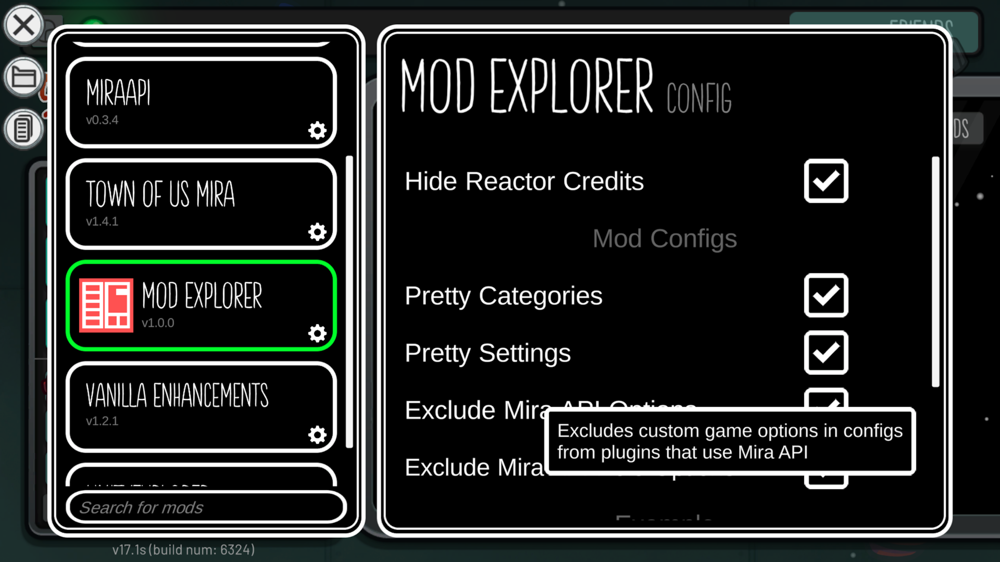

  
  <h2>Mod Explorer</h2>
  

  	<a href="https://github.com/xChipseq/ModExplorer/releases"> 
  	<a href="https://github.com/xChipseq/ModExplorer/stargazers"> 
  	<a href="https://github.com/xChipseq/ModExplorer/releases/latest"> 
  	<a href="https://github.com/xChipseq/ModExplorer/blob/main/LICENSE"> 
  	<a href="https://ko-fi.com/chipseq"> 
  

**Mod Explorer adds an in-game list of all mods installed, in case you ever forget what you are playing with!**

-----------------------

# Mod List
You can access Mod Explorer using the **Mods** button in the main menu.

The opened page shows you a list of all mods that were found installed. When a mod is selected, you can see the information about it. Additional info will be displayed if provided by the developers

> [!TIP]
> If you want to add support for **Mod Explorer** in your mod, take a look at [this](FORDEVS.md).

This menu also allows for quick access to the plugins folder and a mod list you are able to copy to clipboard

-----------------------

# Config Page
By pressing the **cog** icon on a mod card, you can open the plugin configuration tab. Any value can be tweaked without restarting the game, as long as it's a supported type.

Mods made using [Mira API](https://github.com/All-Of-Us-Mods/MiraAPI) have support built-in, excluding **Custom Game Options** & **Role Options** from the config editor

Hover over an entry and click it to see it's description

-----------------------

> This mod is not affiliated with Among Us or Innersloth LLC, and the content contained therein is not endorsed or otherwise sponsored by Innersloth LLC. Portions of the materials contained herein are property of Innersloth LLC.
>
>  © Innersloth LLC.
